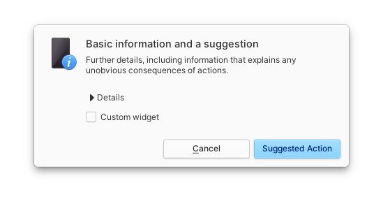
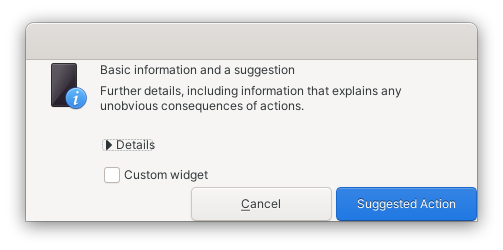
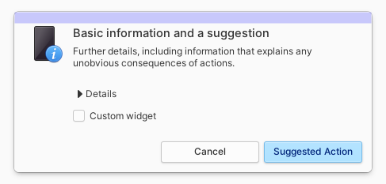

# Ideas

Mostly just ideas I have that I'll probably work on for a few days and forget about it :p

Contact me if you'd like to start on an idea of mine and I'd be glad to contribute!

## [Wingpanel Drives Indicator](https://github.com/pongloongyeat/wingpanel-indicator-drives)

The Pantheon DE provides no way of knowing when someone has plugged in their removable USB drive. Since elementary's HIG reserves indicators for *system* statuses, adding a drive indicator would probably work here.

Ideally, it should show the drive and its available volumes (much like Files shows it) and clicking on the volume should mount it and open it in Files.

<b>Mockup:</b>


<b>Status:</b>
Being worked on

## [KillSwitch](https://github.com/pongloongyeat/killswitch)

Inspired by [killall](https://www.reddit.com/r/MacOS/comments/lt1vlh/a_simple_automator_app_with_an_intuitive_icon/). Allow a user to kill all background apps/non-essential services.

<b>Mockup:</b>


<b>Status:</b>
Finished

<b>Comments:</b>
Inspired by killall, KillSwitch was also written in just one (Python) file. This is doable with very little code in killall since it uses AppleScript, a very descriptive scripting language that integrates very well with Apple's ecosystem, including showing dialogs. Since this isn't possible in elementaryOS, the file seems way too cluttered and has too much UI-related code.

## Extending Granite

Inspired by the issue faced by KillSwitch, it may be quite the dream to add CLI functionality to libgranite, i.e. something like

```bash
granite-message-dialog --primary-text="Are you sure you want to proceed?" \
    --secondary-text="This will kill all selected processes. Please save your work before proceeding" \
    --image-icon-name="dialog-warning" \
    --show-cancel \
    --ok-name="Proceed"
```

This makes it incredibly easy to write bash scripts while maintaining a very native-look to the script.

<b>Status: </b>
Not worked on

<b>Comments: </b>
This could be a possible fork of Granite if this is to be worked on since I doubt elementary's devs would like the extra maintenance debt on Granite that comes with this idea. Maybe `granite-utils`? So it could be `granite-utils --message-dialog`.

## Granite.Dialog

See [elementary/granite#476](https://github.com/elementary/granite/discussions/476). Granite.Dialog only looks good on elementary's own stylesheet and looks broken on Adwaita (see image below). Most custom themes are based-off of Adwaita so adoption of Granite in apps made for other DEs wouldn't be too ideal.

<b>Elementary:</b>



<b>Adwaita:</b>



<b>Status: </b>
Not worked on

<b>Comments: </b>
The best way to start this off is to subclass `Hdy.Window` rather than `Gtk.Dialog`. This gets rid of the empty headerbar so it doesn't show up in both elementary and Adwaita.



Once the headerbar is gone, the margin just needs to be increased all around and you'll get the same old Granite.MessageDialog. After that is mostly reimplementing Gtk's `Dialog` methods.

<!--
## Template

Description.

<b>Mockup:</b>


<b>Status: </b>
Being worked on/Not started/Discontinued/Finished/Not worked on

<b>Comments: </b>
Bla
-->
