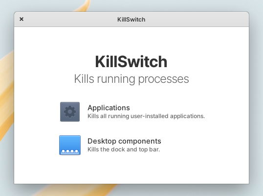

# Ideas

Mostly just ideas I have that I'll probably work on for a few days and forget about it :p

Contact me if you'd like to start on an idea of mine and I'd be glad to contribute!

## Wingpanel Drives Indicator

The Pantheon DE provides no way of knowing when someone has plugged in their removable USB drive. Since elementary's HIG reserves indicators for *system* statuses, adding a drive indicator would probably work here.

Ideally, it should show the drive and its available volumes (much like Files shows it) and clicking on the volume should mount it and open it in Files.

<b>Mockup:</b>

<b>Status:</b>
Being worked on

## KillSwitch

Inspired by [killall](https://www.reddit.com/r/MacOS/comments/lt1vlh/a_simple_automator_app_with_an_intuitive_icon/). Allow a user to kill all background apps/non-essential services.

<b>Mockup:</b>

<b>Status:</b>
Finished

<b>Comments:</b>
Inspired by killall, KillSwitch was also written in just one (Python) file. This is doable with very little code in killall since it uses AppleScript, a very descriptive scripting language that integrates very well with Apple's ecosystem, including showing dialogs. Since this isn't possible in elementaryOS, the file seems way too cluttered and has too much UI-related code.

Perhaps a future rewrite of this is possible, with less to show to the user so the UI part of code doesn't take up the bulk of the file.

<!--
## Template

Description.

<b>Mockup:</b>

<b>Status: </b>
Being worked on/Not started/Discontinued/Finished

<b>Comments: </b>

Bla
-->
